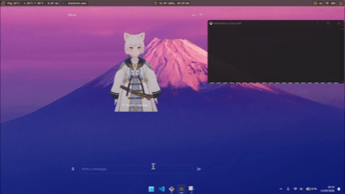
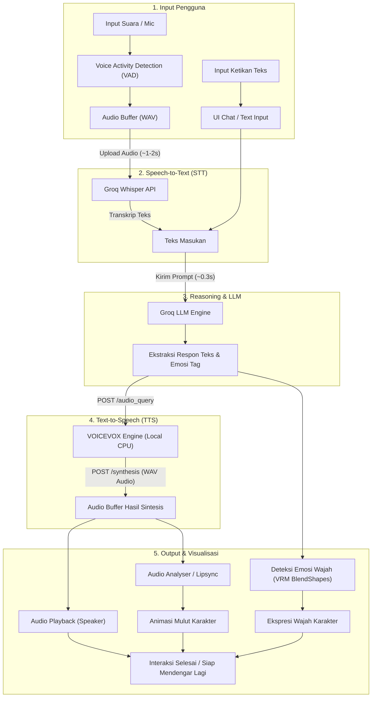

# Nyra | Desktop AI Anime Virtual Assistant

<div align="center">


<p align="center">
  <b>Nyra</b> adalah asisten virtual anime interaktif berbasis desktop yang menggabungkan model 3D VRM, kecerdasan buatan (Groq LLM), voice recognition real-time, serta text-to-speech bahasa Jepang alami bertenaga VOICEVOX.
</p>

<p align="center">
  
</p>

**Bahasa Indonesia** | [English](readme-english.md)

</div>

---

## Tentang Nyra

Nyra dirancang untuk menjadi teman desktop virtual interaktif bergaya anime (AI VTuber). Nyra dapat merespons suara maupun ketikan teks secara cerdas, menggerakkan model 3D anime secara mulus dengan animasi idle, ekspresi emosi wajah (happy, surprised, sad, dan lainnya), hingga lipsync otomatis yang selaras dengan suaranya.

### Fitur Utama

- **Real-time Voice Detection**: Mendengar suara secara otomatis (voice activity detection).
- **Input Teks Fleksibel**: Dapat menggunakan input ketikan jika tidak ingin menggunakan mikrofon.
- **Respon Cepat via Groq**: Didukung LLM berkecepatan tinggi melalui Groq API.
- **Suara Alami via VOICEVOX**: Menggunakan engine TTS lokal dengan puluhan variasi suara anime Jepang.
- **Aman untuk Laptop Kentang**: Model VOICEVOX berjalan secara lokal di CPU tanpa mewajibkan GPU diskrit.
- **Dukungan Model 3D VRM**: Menggunakan model avatar 3D yang dapat diganti dan dikustomisasi (kompatibel dengan VRoid Studio).
- **Floating Desktop Window**: Tampilan transparan tanpa border OS yang bisa digeser dan selalu berada di atas jendela lain (always on top).
- **Multi-platform Desktop**: Mendukung Windows, macOS, dan berbagai distribusi Linux.

---

## Benchmark Kecepatan Respon & Performa

Nyra dirancang dengan pipeline yang sangat teroptimasi untuk interaksi suara secara real-time. Berikut estimasi waktu respon pada setiap tahap pemrosesan:

| Tahapan Pipeline | Komponen / Engine | Estimasi Waktu Respon | Keterangan |
| :--- | :--- | :--- | :--- |
| **Voice Recognition (STT)** | Whisper via Groq | ~1 - 2 detik | Mentranskripsi rekaman suara pengguna menjadi teks secara akurat dan cepat. |
| **Penalaran / Thinking (LLM)** | Groq LPU Inference | ~0.3 detik | Model memproses konteks percakapan, menentukan emosi, dan menyusun jawaban. |
| **Konversi Suara (TTS)** | VOICEVOX (Lokal) | Bervariasi (Tergantung CPU Usage) | Diproses 100% lokal di CPU. Kecepatan sintesis audio bergantung pada beban CPU dan panjang kalimat. |

### Diagram Alur Pipeline Pemrosesan



---

## Dukungan Sistem Operasi

Nyra dibangun di atas runtime Node.js dan framework Electron, sehingga dapat dijalankan di seluruh sistem operasi desktop populer:

| Sistem Operasi | Status Dukungan | Arsitektur | Keterangan |
| :--- | :--- | :--- | :--- |
| **Windows** | Didukung Penuh | x64 (Windows 10 / 11) | Mendukung pembukaan aplikasi bawaan Windows via voice command. |
| **macOS** | Didukung Penuh | Apple Silicon (M1/M2/M3/M4) & Intel (x64) | Memerlukan izin akses mikrofon di System Settings. |
| **Linux** | Didukung Penuh | x64 (Semua distro desktop) | Kompatibel dengan Ubuntu, Debian, Fedora, Arch Linux, Linux Mint, openSUSE, Manjaro, dll. |

---

## Prasyarat Sistem

Sebelum memulai instalasi, pastikan software dan layanan berikut sudah disiapkan:

1. **Node.js** (Disarankan versi LTS 18.x atau 20.x ke atas)  
   Situs resmi: [https://nodejs.org/](https://nodejs.org/)
2. **VOICEVOX** (Engine Text-to-Speech lokal untuk suara karakter)  
   Situs resmi: [https://voicevox.hiroshiba.jp/](https://voicevox.hiroshiba.jp/)  
   *(Pilih versi CPU jika perangkat tidak memiliki GPU diskrit).*
3. **Akun dan API Key Groq** (Layanan LLM gratis dan berkecepatan tinggi)  
   Registrasi dan API Key: [https://console.groq.com/keys](https://console.groq.com/keys)
4. **Git** (Untuk menduplikasi repository ke komputer Anda)  
   Situs resmi: [https://git-scm.com/](https://git-scm.com/)

---

## Panduan Instalasi Berdasarkan Sistem Operasi

Pilih instruksi instalasi sesuai dengan sistem operasi yang Anda gunakan:

### 1. Instalasi di Windows

#### Langkah A: Pasang Node.js & Git
1. Unduh installer Node.js (versi LTS) dari [nodejs.org](https://nodejs.org/) dan jalankan file installer `.msi`.
2. Unduh Git dari [git-scm.com](https://git-scm.com/) dan pasang hingga selesai.
3. Buka PowerShell atau Command Prompt, pastikan instalasi berhasil:
   ```bash
   node -v
   npm -v
   git --version
   ```

#### Langkah B: Unduh dan Jalankan VOICEVOX di Windows
1. Kunjungi situs resmi VOICEVOX: [https://voicevox.hiroshiba.jp/](https://voicevox.hiroshiba.jp/).
2. Unduh paket installer atau zip untuk Windows (versi CPU atau DirectML/GPU).
3. Ekstrak dan jalankan aplikasi VOICEVOX (`VOICEVOX.exe`).
4. Biarkan aplikasi berjalan di background. Server lokal akan aktif pada port `http://localhost:50021`.

---

### 2. Instalasi di macOS

#### Langkah A: Pasang Node.js & Git
Anda dapat memasang Node.js dan Git menggunakan Homebrew melalui Terminal:
```bash
# Jika belum memiliki Homebrew:
# /bin/bash -c "$(curl -fsSL https://raw.githubusercontent.com/Homebrew/install/HEAD/install.sh)"

brew install node git
```
Verifikasi versi:
```bash
node -v
npm -v
git --version
```

#### Langkah B: Unduh dan Jalankan VOICEVOX di macOS
1. Kunjungi [https://voicevox.hiroshiba.jp/](https://voicevox.hiroshiba.jp/).
2. Unduh file disk image (`.dmg`) yang sesuai dengan arsitektur Mac Anda:
   - Pilih **Apple Silicon** jika menggunakan prosesor M1/M2/M3/M4.
   - Pilih **Intel** jika menggunakan prosesor Mac berbasis Intel.
3. Buka file `.dmg`, seret ikon VOICEVOX ke folder `Applications`.
4. Buka aplikasi VOICEVOX.
   *(Jika muncul peringatan keamanan macOS Gatekeeper, buka `System Settings` > `Privacy & Security`, lalu izinkan pembukaan aplikasi).*
5. Pastikan VOICEVOX tetap menyala di background (aktif di `http://localhost:50021`).

---

### 3. Instalasi di Linux (Semua Distro Desktop)

Nyra mendukung seluruh distribusi desktop Linux (Ubuntu, Debian, Fedora, Arch Linux, Linux Mint, Manjaro, openSUSE, dll.).

#### Langkah A: Pasang Node.js, Git, dan Dependensi Media
Buka terminal pada distro Anda dan jalankan perintah yang sesuai:

- **Ubuntu / Debian / Linux Mint / Pop!_OS**:
  ```bash
  sudo apt update
  sudo apt install -y git curl build-essential libasound2-dev
  # Pasang Node.js LTS via NodeSource
  curl -fsSL https://deb.nodesource.com/setup_20.x | sudo -E bash -
  sudo apt install -y nodejs
  ```

- **Fedora / RHEL**:
  ```bash
  sudo dnf install -y git nodejs npm alsa-lib-devel
  ```

- **Arch Linux / Manjaro**:
  ```bash
  sudo pacman -Syu --needed git nodejs npm alsa-lib
  ```

Verifikasi versi:
```bash
node -v
npm -v
git --version
```

#### Langkah B: Unduh dan Jalankan VOICEVOX di Linux
VOICEVOX untuk Linux tersedia dalam format **AppImage** mandiri dan kontainer Docker. Cara termudah adalah menggunakan AppImage:

1. Unduh paket Linux AppImage dari situs resmi: [https://voicevox.hiroshiba.jp/](https://voicevox.hiroshiba.jp/).
2. Berikan izin eksekusi pada file AppImage yang telah diunduh:
   ```bash
   chmod +x VOICEVOX*.AppImage
   ```
3. Jalankan file AppImage tersebut:
   ```bash
   ./VOICEVOX*.AppImage
   ```
4. Biarkan aplikasi VOICEVOX tetap aktif di background.
   *(Alternatif bagi pengguna server/headless Linux: VOICEVOX Engine juga dapat dijalankan via Docker Image resmi `voicevox/voicevox_engine:cpu-ubuntu20.04-latest` dengan mengekspos port 50021).*

---

## Konfigurasi dan Menjalankan Proyek

Setelah Node.js dan VOICEVOX sudah terpasang dan berjalan di sistem operasi Anda, ikuti langkah berikut untuk mengonfigurasi dan menjalankan Nyra:

### 1. Dapatkan API Key Groq
1. Kunjungi [https://console.groq.com/keys](https://console.groq.com/keys).
2. Masuk atau buat akun Groq secara gratis.
3. Buat API Key baru dan salin kunci tersebut.

### 2. Clone Repository
Buka terminal (atau Command Prompt / PowerShell):
```bash
git clone https://github.com/Mipan-Zuzu/Nyra.git
cd Nyra
```

### 3. Pasang Dependensi Proyek
```bash
npm install
```

### 4. Buat File Konfigurasi Environment (.env)
Salin template konfigurasi `.env.example` ke file baru bernama `.env`:

- **Di Windows (PowerShell / Command Prompt)**:
  ```powershell
  copy .env.example .env
  ```
- **Di macOS / Linux (Terminal)**:
  ```bash
  cp .env.example .env
  ```

Buka file `.env` dan masukkan API Key Groq yang sudah Anda dapatkan:
```env
AI_API_KEY=gsk_masukkan_api_key_groq_disini
```

### 5. Jalankan Nyra
Pastikan aplikasi VOICEVOX sudah dalam keadaan berjalan, kemudian jalankan:
```bash
npm start
```
Jendela karakter Nyra akan muncul di sudut kanan bawah desktop Anda dan langsung siap digunakan.

---

## Tips Penggunaan

### Mengatur Voice Recognition (Mikrofon)
- **Mendengarkan Real-time**: Deteksi suara berjalan secara otomatis. Nyra akan terus mendengarkan suara Anda dan merespons saat mendeteksi percakapan.
- **Menonaktifkan Mode Suara Real-time**:
  - Klik **ikon mikrofon** di panel bawah antarmuka aplikasi untuk mematikan mode deteksi suara otomatis.
  - Saat mikrofon dinonaktifkan, Anda dapat mengetik pesan melalui **kolom ketikan teks**, lalu menekan `Enter` atau tombol kirim untuk berinteraksi.

---

## Kustomisasi Karakter dan Suara

### 1. Mengganti Suara Karakter (Custom Voice VOICEVOX)
VOICEVOX berjalan 100% secara lokal menggunakan CPU, sehingga sangat hemat daya dan aman untuk laptop dengan spesifikasi standar tanpa GPU diskrit. Terdapat lebih dari 70 jenis suara karakter yang dapat digunakan.

Cara mengganti suara karakter:
1. Buka file `main.js` dengan teks editor atau IDE pilihan Anda.
2. Tekan `Ctrl + F` (atau `Cmd + F` di macOS), lalu cari baris:
   ```javascript
   const SPEAKER_ID = 3;
   ```
3. Ubah nilai angka `SPEAKER_ID` sesuai dengan ID karakter yang diinginkan.
   > **Rekomendasi Speaker ID:**  
   > ID `3` (Zundamon), `13` (Aoyama Ryuusei), `18`, `19`, atau `48`.
4. Simpan perubahan file `main.js` lalu jalankan kembali aplikasi (`npm start`).

---

### 2. Kustomisasi Model Anime 3D (VRM)
Model karakter anime 3D dapat diganti menggunakan avatar rancangan Anda sendiri:

1. Buat atau ubah karakter anime 3D menggunakan aplikasi avatar 3D seperti **[VRoid Studio](https://vroid.com/en/studio)** (tersedia gratis untuk Windows dan macOS) atau software 3D seperti Blender.
2. Ekspor model tersebut ke dalam format file berekstensi **`.vrm`**.
3. Pindahkan file hasil ekspor ke **root folder proyek** (sejajar dengan file `main.js` dan `package.json`).
4. Beri nama file tersebut:
   ```
   anime.vrm
   ```
   *(Pastikan ekstensi file tetap `.vrm`)*.
5. Saat Nyra dijalankan, model 3D baru Anda akan langsung dimuat secara otomatis di layar.

---

## Struktur Proyek

```plaintext
Nyra/
├── anime.vrm            # Model 3D karakter anime (format VRM)
├── main.js              # Proses utama Electron, konfigurasi window, integrasi Groq & VOICEVOX
├── preload.js           # Bridge API aman antara main process dan renderer UI
├── package.json         # Konfigurasi dependensi project
├── .env.example         # Template konfigurasi environment variable
├── .env                 # File environment (tempat menyimpan AI_API_KEY)
└── renderer/            # Antarmuka pengguna (front-end)
    ├── index.html       # Struktur UI chat, canvas 3D, dan kontrol jendela
    ├── style.css        # Gaya visual jendela transparan dan elemen UI
    └── app.js           # Logika Three.js, loader VRM, lipsync, pose, dan chat handler
```

---

## Tanya Jawab dan Penyelesaian Masalah

<details>
<summary><b>1. Suara karakter tidak muncul atau muncul error ECONNREFUSED?</b></summary>
Pastikan aplikasi VOICEVOX sudah dibuka dan aktif berjalan di latar belakang sebelum Anda mengeksekusi <code>npm start</code>. VOICEVOX secara bawaan melayani request pada port <code>50021</code>.
</details>

<details>
<summary><b>2. Model 3D tidak tampil di layar desktop?</b></summary>
Pastikan file model bernama <code>anime.vrm</code> berada tepat di root folder proyek dan berkas tersebut merupakan file VRM yang valid.
</details>

<details>
<summary><b>3. Nyra tidak merespons input suara atau teks?</b></summary>
Periksa kembali file <code>.env</code> Anda. Pastikan variabel <code>AI_API_KEY</code> telah diisi dengan API Key Groq yang masih aktif dan valid.
</details>

<details>
<summary><b>4. Mikrofon tidak mendeteksi suara di macOS atau Linux?</b></summary>
Pada macOS, pastikan Terminal / editor Anda telah diizinkan untuk mengakses Microphone di menu <code>System Settings > Privacy & Security > Microphone</code>. Pada Linux, pastikan driver audio (ALSA / PulseAudio / PipeWire) telah mengizinkan akses ke perangkat mikrofon default.
</details>

<details>
<summary><b>5. Apakah aplikasi membutuhkan koneksi internet?</b></summary>
Render model 3D dan pengolahan suara (VOICEVOX) berjalan sepenuhnya secara lokal di komputer tanpa internet. Namun untuk proses penalaran dan kecerdasan buatan (Groq LLM), koneksi internet tetap dibutuhkan.
</details>

---

## Lisensi dan Atribusi

Proyek ini dikembangkan untuk tujuan pembelajaran, hobi, dan eksperimen asisten virtual desktop berbasis AI.  
Model VRM dan suara VOICEVOX tunduk pada ketentuan lisensi serta atribusi dari masing-masing kreator aslinya.
