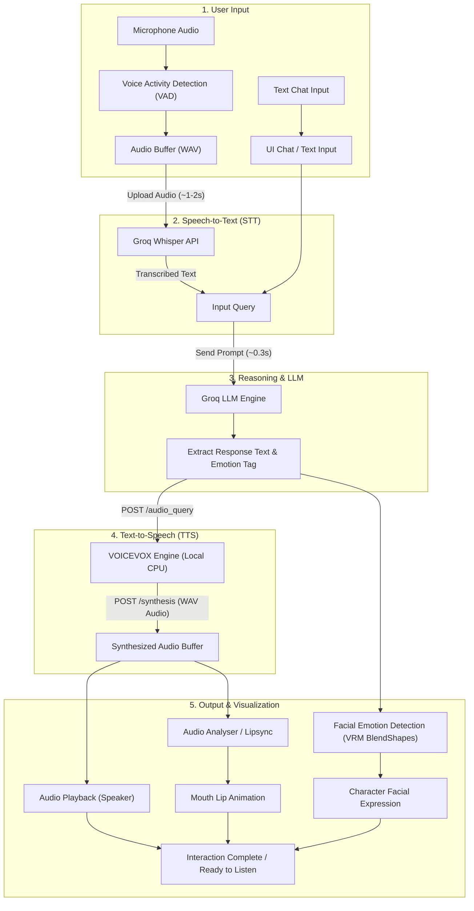

# Nyra | Desktop AI Anime Virtual Assistant

<div align="center">


<p align="center">
  <b>Nyra</b> is an interactive anime-styled desktop virtual assistant that integrates 3D VRM models, artificial intelligence (Groq LLM), real-time voice recognition, and natural Japanese text-to-speech powered locally by VOICEVOX.
</p>

<p align="center">
  
</p>

[Bahasa Indonesia](README.md) | **English**

</div>

---

## About Nyra

Nyra is designed as an interactive anime desktop companion (AI VTuber). Nyra responds intelligently to both voice and text inputs, renders smooth 3D animations with idle motions, displays emotional facial expressions (happy, surprised, sad, and more), and delivers automatic lipsync synchronized with synthesized speech.

### Key Features

- **Real-time Voice Detection**: Automatically listens and detects speech using Voice Activity Detection (VAD).
- **Flexible Text Input**: Switch seamlessly to typed chat if you prefer not to use a microphone.
- **Fast Reasoning via Groq**: Powered by high-speed LLM inference through the Groq API.
- **Natural Voice via VOICEVOX**: Local text-to-speech engine featuring dozens of expressive Japanese anime character voices.
- **Low-Spec PC Friendly**: VOICEVOX runs 100% locally on CPU without requiring a dedicated discrete GPU.
- **3D VRM Model Support**: Load and customize any 3D anime avatar (fully compatible with VRoid Studio).
- **Floating Desktop Window**: Borderless, draggable, and transparent window with an always-on-top toggle.
- **Multi-platform Desktop**: Complete support for Windows, macOS, and Linux distributions.

---

## Benchmark & Performance

Nyra is built with an optimized processing pipeline tailored for real-time voice conversation. Estimated response latencies for each stage:

| Pipeline Stage | Component / Engine | Estimated Latency | Description |
| :--- | :--- | :--- | :--- |
| **Voice Recognition (STT)** | Whisper via Groq | ~1 - 2 seconds | Transcribes user audio recordings into text quickly and accurately. |
| **Reasoning / Thinking (LLM)** | Groq LPU Inference | ~0.3 seconds | Processes conversational context, selects emotion tags, and crafts replies. |
| **Voice Synthesis (TTS)** | VOICEVOX (Local) | Variable (CPU-dependent) | Processed 100% locally on CPU. Speed depends on CPU load and sentence length. |

### Pipeline Architecture Diagram



---

## Operating System Support

Nyra is built on Node.js and the Electron framework, running across major desktop operating systems:

| Operating System | Support Status | Architecture | Notes |
| :--- | :--- | :--- | :--- |
| **Windows** | Fully Supported | x64 (Windows 10 / 11) | Supports opening native Windows applications via voice commands. |
| **macOS** | Fully Supported | Apple Silicon (M1/M2/M3/M4) & Intel (x64) | Requires microphone permission under System Settings. |
| **Linux** | Fully Supported | x64 (All desktop distros) | Compatible with Ubuntu, Debian, Fedora, Arch Linux, Linux Mint, openSUSE, Manjaro, etc. |

---

## Prerequisites

Before installing, ensure you have the following prerequisites prepared:

1. **Node.js** (LTS version 18.x or 20.x+ recommended)  
   Official Website: [https://nodejs.org/](https://nodejs.org/)
2. **VOICEVOX** (Local Text-to-Speech engine for character voice)  
   Official Website: [https://voicevox.hiroshiba.jp/](https://voicevox.hiroshiba.jp/)  
   *(Select CPU version if your machine lacks a dedicated GPU).*
3. **Groq Account & API Key** (Fast and accessible LLM service)  
   Sign up & generate key: [https://console.groq.com/keys](https://console.groq.com/keys)
4. **Git** (For cloning the repository)  
   Official Website: [https://git-scm.com/](https://git-scm.com/)

---

## Installation Guide by OS

Follow the installation instructions matching your operating system:

### 1. Installation on Windows

#### Step A: Install Node.js & Git
1. Download the Node.js LTS installer from [nodejs.org](https://nodejs.org/) and run the `.msi` setup file.
2. Download Git from [git-scm.com](https://git-scm.com/) and complete the installation.
3. Open PowerShell or Command Prompt, and verify installation:
   ```bash
   node -v
   npm -v
   git --version
   ```

#### Step B: Download and Run VOICEVOX on Windows
1. Visit the official VOICEVOX website: [https://voicevox.hiroshiba.jp/](https://voicevox.hiroshiba.jp/).
2. Download the Windows installer or zip archive (CPU or DirectML/GPU version).
3. Extract and launch the application (`VOICEVOX.exe`).
4. Keep it running in the background. The local engine will listen on `http://localhost:50021`.

---

### 2. Installation on macOS

#### Step A: Install Node.js & Git
You can install Node.js and Git via Homebrew using Terminal:
```bash
# If you don't have Homebrew installed:
# /bin/bash -c "$(curl -fsSL https://raw.githubusercontent.com/Homebrew/install/HEAD/install.sh)"

brew install node git
```
Verify versions:
```bash
node -v
npm -v
git --version
```

#### Step B: Download and Run VOICEVOX on macOS
1. Visit [https://voicevox.hiroshiba.jp/](https://voicevox.hiroshiba.jp/).
2. Download the disk image (`.dmg`) matching your Mac architecture:
   - Choose **Apple Silicon** for M1/M2/M3/M4 chips.
   - Choose **Intel** for Intel-based Macs.
3. Open the `.dmg` file and drag the VOICEVOX icon into your `Applications` folder.
4. Launch VOICEVOX.
   *(If prompted by macOS Gatekeeper, navigate to `System Settings` > `Privacy & Security` and allow opening the app).*
5. Keep VOICEVOX running in the background (active on `http://localhost:50021`).

---

### 3. Installation on Linux (All Desktop Distros)

Nyra supports all major Linux desktop distributions (Ubuntu, Debian, Fedora, Arch Linux, Linux Mint, Manjaro, openSUSE, etc.).

#### Step A: Install Node.js, Git, and Media Dependencies
Open your terminal and execute the commands matching your distribution:

- **Ubuntu / Debian / Linux Mint / Pop!_OS**:
  ```bash
  sudo apt update
  sudo apt install -y git curl build-essential libasound2-dev
  # Install Node.js LTS via NodeSource
  curl -fsSL https://deb.nodesource.com/setup_20.x | sudo -E bash -
  sudo apt install -y nodejs
  ```

- **Fedora / RHEL**:
  ```bash
  sudo dnf install -y git nodejs npm alsa-lib-devel
  ```

- **Arch Linux / Manjaro**:
  ```bash
  sudo pacman -Syu --needed git nodejs npm alsa-lib
  ```

Verify versions:
```bash
node -v
npm -v
git --version
```

#### Step B: Download and Run VOICEVOX on Linux
VOICEVOX for Linux is available as a standalone **AppImage** and as a Docker container. The AppImage is the simplest approach:

1. Download the Linux AppImage from the official website: [https://voicevox.hiroshiba.jp/](https://voicevox.hiroshiba.jp/).
2. Grant executable permissions to the downloaded file:
   ```bash
   chmod +x VOICEVOX*.AppImage
   ```
3. Run the AppImage:
   ```bash
   ./VOICEVOX*.AppImage
   ```
4. Keep VOICEVOX active in the background.  
   *(Alternative for server/headless setups: You can also run the official Docker image `voicevox/voicevox_engine:cpu-ubuntu20.04-latest` exposing port 50021).*

---

## Configuration & Getting Started

Once Node.js and VOICEVOX are running on your system, follow these steps to set up and run Nyra:

### 1. Obtain a Groq API Key
1. Go to [https://console.groq.com/keys](https://console.groq.com/keys).
2. Log in or register for a free account.
3. Create a new API Key and copy it.

### 2. Clone the Repository
Open your terminal (or Command Prompt / PowerShell):
```bash
git clone https://github.com/Mipan-Zuzu/Nyra.git
cd Nyra
```

### 3. Install Project Dependencies
```bash
npm install
```

### 4. Create the Environment File (.env)
Copy the `.env.example` template into a new `.env` file:

- **Windows (PowerShell / Command Prompt)**:
  ```powershell
  copy .env.example .env
  ```
- **macOS / Linux (Terminal)**:
  ```bash
  cp .env.example .env
  ```

Open the `.env` file and paste your Groq API key:
```env
AI_API_KEY=gsk_your_groq_api_key_here
```

### 5. Start Nyra
Ensure the VOICEVOX application is running, then launch:
```bash
npm start
```
The Nyra avatar window will appear in the bottom-right corner of your desktop, ready for interaction.

---

## Usage Tips

### Managing Voice Recognition (Microphone)
- **Real-time Listening**: Speech detection is automated. Nyra continuously listens and responds whenever speech is detected.
- **Toggle Voice Detection**:
  - Click the **microphone icon** on the bottom control panel to disable automatic voice detection.
  - When the microphone is turned off, you can type messages in the **chat input field** and press `Enter` or the send button.

---

## Character & Voice Customization

### 1. Custom Character Voice (VOICEVOX Speaker)
VOICEVOX runs 100% locally on CPU, ensuring energy-efficient performance without requiring a discrete GPU. Over 70 character voices are available.

To change the voice:
1. Open `main.js` in your preferred editor.
2. Search for:
   ```javascript
   const SPEAKER_ID = 3;
   ```
3. Change `SPEAKER_ID` to your preferred voice ID.
   > **Recommended Speaker IDs:**  
   > ID `3` (Zundamon), `13` (Aoyama Ryuusei), `18`, `19`, or `48`.
4. Save `main.js` and restart the application (`npm start`).

---

### 2. Customizing the 3D Anime Avatar (VRM)
You can replace the default 3D model with your own custom avatar:

1. Create or customize your 3D avatar using tools like **[VRoid Studio](https://vroid.com/en/studio)** (free for Windows and macOS) or 3D software like Blender.
2. Export your avatar as a **`.vrm`** file.
3. Move the exported file to the **project root directory** (alongside `main.js` and `package.json`).
4. Name the file:
   ```
   anime.vrm
   ```
   *(Ensure the extension remains `.vrm`)*.
5. Launch Nyra, and your custom 3D model will automatically load.

---

## Project Structure

```plaintext
Nyra/
├── anime.vrm            # 3D anime avatar model (VRM format)
├── main.js              # Electron main process, window management, Groq & VOICEVOX integration
├── preload.js           # Secure IPC bridge between main and renderer processes
├── package.json         # Project configuration and dependencies
├── .env.example         # Environment variables template
├── .env                 # Local environment file (stores AI_API_KEY)
└── renderer/            # Front-end UI and renderer
    ├── index.html       # Chat UI structure, 3D canvas, and window controls
    ├── style.css        # Transparent window styling and UI layouts
    └── app.js           # Three.js logic, VRM loader, lipsync, pose animations, chat handler
```

---

## Frequently Asked Questions & Troubleshooting

<details>
<summary><b>1. No voice output or ECONNREFUSED error?</b></summary>
Ensure the VOICEVOX application is open and actively running in the background before running <code>npm start</code>. VOICEVOX listens on port <code>50021</code> by default.
</details>

<details>
<summary><b>2. 3D model does not appear on screen?</b></summary>
Verify that a valid VRM file named <code>anime.vrm</code> is placed directly in the project's root folder.
</details>

<details>
<summary><b>3. Nyra does not respond to voice or text input?</b></summary>
Check your <code>.env</code> file to verify that <code>AI_API_KEY</code> is correctly set with a valid, active Groq API key.
</details>

<details>
<summary><b>4. Microphone is not detecting audio on macOS or Linux?</b></summary>
On macOS, verify that Terminal / your editor has microphone permission in <code>System Settings > Privacy & Security > Microphone</code>. On Linux, ensure your audio server (ALSA / PulseAudio / PipeWire) allows access to your default input device.
</details>

<details>
<summary><b>5. Does this application require an active internet connection?</b></summary>
3D avatar rendering and voice synthesis (VOICEVOX) run completely offline on your local machine. However, speech transcription and LLM reasoning (Groq) require an active internet connection.
</details>

---

## License & Attribution

This project is developed for educational, hobbyist, and experimental purposes in building desktop AI virtual assistants.  
The 3D VRM model and VOICEVOX audio assets remain subject to the respective licensing terms and attribution policies of their original creators.
